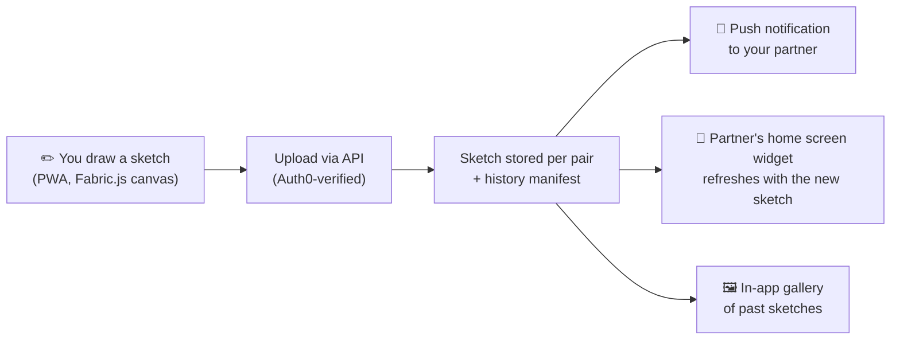
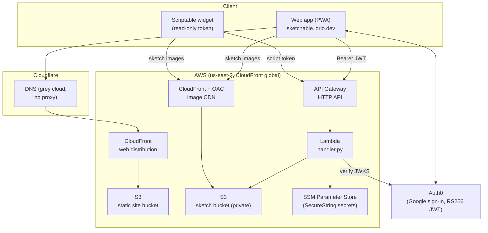
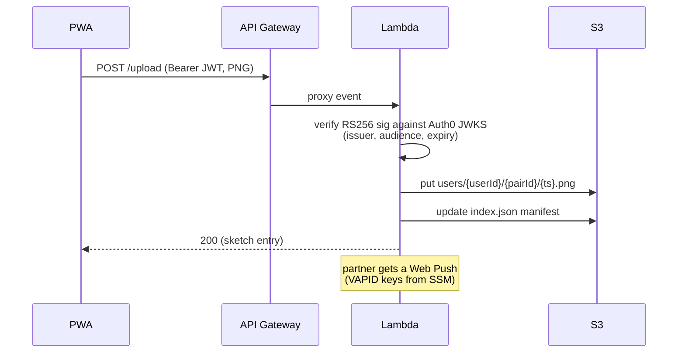

# Sketchable

A progressive web app inspired by sketch/note drawing apps such as noteit.
Tailored for iOS mobile users. Widget support included provided via [Scriptable](https://scriptable.app)

## How it works

- **Pairing** — one person generates an invite code, the other redeems it.
  From then on, all sketches are scoped to that pair.
- **No accounts to manage** — sign in with Google (via Auth0); your identity
  is your token, the client never asserts its own user id.
- **No database** — sketches are PNGs in S3, ordered history is a per-stream
  `index.json` manifest.

## Repo layout

| Path | What |
|---|---|
| [`frontend/`](frontend/) | React 19 + Vite + Tailwind v4 PWA; Fabric.js canvas with custom brushes |
| [`frontend/scriptable/`](frontend/scriptable/) | iOS home-screen widget script (handed out during onboarding) |
| [`backend/lambda/`](backend/lambda/) | Python Lambda API (SAM) — upload gatekeeper, pairing, tokens |
| [`backend/web/`](backend/web/) | SAM template for static web hosting (S3 + CloudFront) |
| [`infra/`](infra/), [`scripts/`](scripts/) | IAM policies and deploy scripts |

## Infrastructure

Everything runs serverless on AWS, deployed with SAM. Two environments,
branch-driven: `main` → production, `develop` → staging (see
[`DEPLOYMENT.md`](DEPLOYMENT.md) for the full runbook).

### Request path for an upload

Key points:

- **Auth** — every protected route requires an Auth0 access token; the Lambda
  verifies the signature itself against the tenant's JWKS. The widget uses a
  separate long-lived read-only token minted by `POST /me/script-token`
  (signed with a secret held in SSM).
- **Storage** — one private S3 bucket, keyed
  `users/{userId}/{pairId}/{timestamp}.png`, served read-only through
  CloudFront with Origin Access Control. No database anywhere.
- **Secrets** — script-token secret, Auth0 management secret, and VAPID
  private key live in SSM Parameter Store as SecureStrings, per environment.
- **TLS/DNS** — ACM certs (us-east-1 for CloudFront, us-east-2 for the API
  custom domain); Cloudflare holds DNS but does not proxy.
